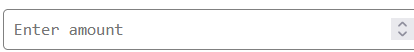
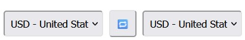

# Realtime Currency Converter

This project demonstrates how to build a simple currency converter using three different technologies:
- **Python**: A command-line tool for currency conversion.
- **JavaScript**: A static HTML + JS frontend for in-browser conversion.
- **C#**: An ASP.NET Razor Page for a dynamic web-based converter.

The main problem this porject solves is convert one currency to another easily without problems or complications.

## How to Run

### Python Version
1. Run `currency_converter.py` using Python 3.x.
2. Follow the on-screen prompts to perform currency conversions.

### Static HTML + JavaScript Version
1. Open `index.html` in any modern web browser.
2. Enter the amount and select currencies to perform the conversion.

### C# ASP.NET Version
1. Add `currency_converter_aspnet.cshtml` to an ASP.NET Core Razor Pages project in Visual Studio.
2. Run the project to access the web-based converter.

## Highlight
The higlight of this project the many currencies offered which is provided in this code:

 #           "USD"
 #           "EUR"
 #           "GBP"
 #           "BAM"
 #           "ALL"
 #           "HRK"
 #           "MKD"
 #           "RSD"
 #           "CNY"
 #           "JPY"
        

  
The components 

# Contact

Maintainer - Haris Kjerimi - 210302156@student.ius.edu.ba

## License
This project is licensed under the MIT License.

# Improvements for the future
In the future the C# is going to be used to convert it to an online coverter.
